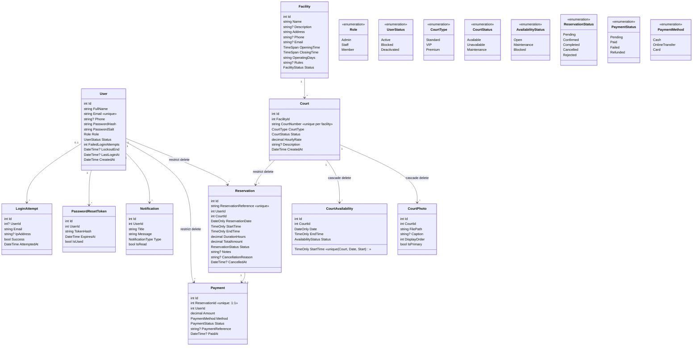

# BadmintonHub — Entity Class Diagram

11 entities + 8 enums, EF Core Code First (Data Annotations). Generated from
the actual `BadmintonHub/Models/*.cs` sources, not from a tool — the diagram
below is the authoritative shape of the schema.

## Design decisions

| Decision | Why |
|---|---|
| Single `User` table for all roles (`Role` enum) | Manual cookie auth without Identity; one profile record per person |
| Passwords as base64 PBKDF2 hash + salt columns | Assignment rule: never store plain-text passwords |
| `Payment` 1:1 with `Reservation` | Each booking has exactly one payment record; statuses stay consistent (paid ⇔ confirmed, reject ⇒ failed, cancel of paid ⇒ refunded) |
| `ReservationReference` `BH-{year}-{seq:000000}` | Human-friendly, **public-safe**: the QR code carries only this reference |
| Cascade vs restrict deletes | Photos/availability die with their court; courts and users with reservation history are protected (financial/audit trail) |
| `PasswordResetToken.TokenHash` single-use, 30-min expiry | Reset links never store the raw token |
| Unique index `(CourtId, Date, StartTime)` on availability | One slot row per court/date/hour |
